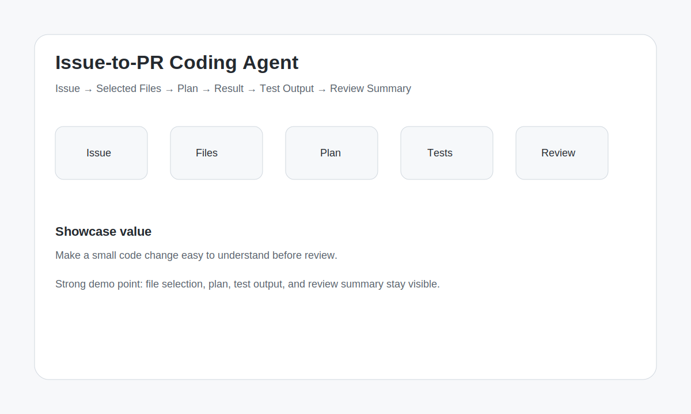

# Design Gallery

## Overview

## Demo intent

Use this visual as the first layout direction for the MVP demo.

The product should make code review workflow visible through:

- issue intake
- selected files
- plan
- result
- test output
- review summary
